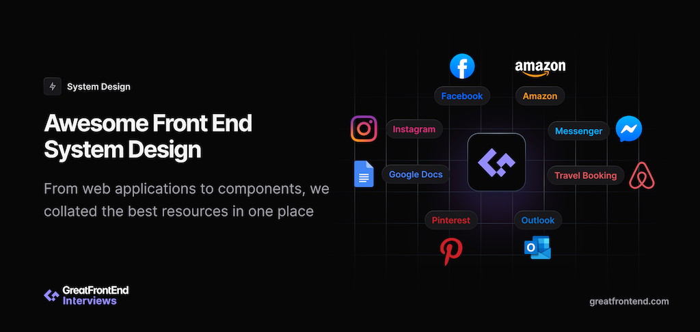

<a href="https://www.greatfrontend.com/system-design/" target="_blank">
  
</a>

Front end system design resources are rare. Here's a curated list of awesome resources of front end system design resources, great for interview preparation or general learning.

## General

- Websites
  - [GreatFrontEnd's Front End System Design Guidebook](https://www.greatfrontend.com/system-design)
    - [RADIO Framework for Front End System Design](https://www.greatfrontend.com/system-design/framework)
  - [Front End Interview Handbook](https://www.frontendinterviewhandbook.com/front-end-system-design/)
  - [Frontend system design interviews - the definitive guide](https://frontendmastery.com/posts/frontend-system-design-interview-guide/)
- YouTube
  - [Front-End Engineer (makes content on Front End System Design)](https://www.youtube.com/@FrontEndEngineer)

## Applications

### News Feed (e.g. Facebook)

_Examples: [facebook.com](https://www.facebook.com/), [twitter.com](https://www.twitter.com/), [reddit.com](https://www.reddit.com/), [quora.com](https://www.quora.com/)_

- Guides
  - [GreatFrontEnd's News Feed System Design Solution](https://www.greatfrontend.com/questions/system-design/news-feed-facebook)
  - [[Front End System Design] - Facebook News Feed](https://www.youtube.com/watch?v=5vyKhm2NTfw)
- Case Studies
  - Facebook
    - [Rebuilding our tech stack for the new Facebook.com](https://engineering.fb.com/2020/05/08/web/facebook-redesign/)
    - [Making Facebook.com accessible to as many people as possible](https://engineering.fb.com/2020/07/30/web/facebook-com-accessibility/)
  - Twitter
    - [How we built Twitter Lite](https://blog.twitter.com/engineering/en_us/topics/open-source/2017/how-we-built-twitter-lite)
    - [Building the new Twitter.com](https://blog.twitter.com/engineering/en_us/topics/infrastructure/2019/buildingthenewtwitter)
    - [Dissecting Twitter's Redux Store](https://medium.com/statuscode/dissecting-twitters-redux-store-d7280b62c6b1)
    - [Twitter Lite and High Performance React Progressive Web Apps at Scale](https://medium.com/@paularmstrong/twitter-lite-and-high-performance-react-progressive-web-apps-at-scale-d28a00e780a3)
  - Instagram
    - [Making Instagram.com faster: Part 1](https://instagram-engineering.com/making-instagram-com-faster-part-1-62cc0c327538)
    - [Making Instagram.com faster: Part 2](https://instagram-engineering.com/making-instagram-com-faster-part-2-f350c8fba0d4)
    - [Making Instagram.com faster: Part 3 — cache first](https://instagram-engineering.com/making-instagram-com-faster-part-3-cache-first-6f3f130b9669)
- Resources
  - [Facebook open sources rich text editor framework Draft.js](https://engineering.fb.com/2016/02/26/web/facebook-open-sources-rich-text-editor-framework-draft-js/)
  - [Evolving API Pagination at Slack](https://slack.engineering/evolving-api-pagination-at-slack)

### E-Commerce Site (e.g. Amazon)

_Examples: [amazon.com](https://www.amazon.com), [ebay.com](https://www.ebay.com), [walmart.com](https://www.walmart.com), [flipkart.com](https://www.flipkart.com)_

- Guides
  - [GreatFrontEnd's E-Commerce Site System Design Solution](https://www.greatfrontend.com/questions/system-design/e-commerce-amazon) (Paid)
- Case Studies
  - eBay
    - [Shopping for speed on eBay.com | web.dev](https://web.dev/shopping-for-speed-on-ebay/)
    - [Speed By A Thousand Cuts | eBay Engineering Blog](https://tech.ebayinc.com/engineering/speed-by-a-thousand-cuts/)
  - Others
    - [How Rakuten 24's investment in Core Web Vitals increased revenue per visitor by 53.37% and conversion rate by 33.13% | web.dev](https://web.dev/rakuten/)
    - [Luxury retailer Farfetch sees higher conversion rates for better Core Web Vitals](https://web.dev/farfetch/)
    - [How focusing on web performance improved Tokopedia's click-through rate by 35% | web.dev](https://web.dev/tokopedia/)
    - [How Renault improved its bounce and conversion rates by measuring and optimizing Largest Contentful Paint](https://web.dev/renault/)
    - [Lowe's website is among fastest performing e-commerce websites](https://web.dev/lowes/)
    - [JD.ID improves their mobile conversion rate by 53% with caching strategies, installation, and push notifications](https://web.dev/jdid/)
- Resources
  - [Milliseconds make millions](https://web.dev/milliseconds-make-millions/)
  - [Autofill on Browsers: A Deep Dive | eBay Engineering Blog](https://tech.ebayinc.com/engineering/autofill-deep-dive/)
  - [Autofilling | web.dev](https://web.dev/learn/forms/autofill/)
  - [Address forms | Learn Forms! | web.dev](https://web.dev/learn/forms/address/)
  - [Payment and address form best practices | web.dev](https://web.dev/payment-and-address-form-best-practices/)
  - [Frank's Compulsive Guide to Postal Addresses](http://www.columbia.edu/~fdc/postal/)

### Photo Sharing (e.g. Instagram)

_Examples: [instagram.com](https://www.instagram.com), [flickr.com](https://www.flickr.com)_

- Guides
  - [GreatFrontEnd's Photo Sharing System Design Solution](https://www.greatfrontend.com/questions/system-design/photo-sharing-instagram) (Paid)
- Case Studies
  - Instagram
    - [Making Instagram.com faster: Part 1](https://instagram-engineering.com/making-instagram-com-faster-part-1-62cc0c327538)
    - [Making Instagram.com faster: Part 2](https://instagram-engineering.com/making-instagram-com-faster-part-2-f350c8fba0d4)
    - [Making Instagram.com faster: Part 3 — cache first](https://instagram-engineering.com/making-instagram-com-faster-part-3-cache-first-6f3f130b9669)
    - [Making instagram.com faster: Code size and execution optimizations (Part 4)](https://instagram-engineering.com/making-instagram-com-faster-code-size-and-execution-optimizations-part-4-57668be796a8)
    - [Launching Instagram Messaging on desktop](https://about.instagram.com/blog/engineering/launching-instagram-messaging-on-desktop)
    - [Crafting an Accessible Instagram Feed](https://about.instagram.com/blog/engineering/crafting-an-accessible-instagram-feed)
- Resources
  - [Instagram.css](https://picturepan2.github.io/instagram.css/)

### Chat App (e.g. Messenger)

_Examples: [Messenger](https://www.messenger.com), [WhatsApp Web](https://www.whatsapp.com), [Slack](https://www.slack.com), [Discord](https://www.discord.com), [Telegram](https://www.telegram.org)_

- Guides
  - [GreatFrontEnd's Chat App System Design Solution](https://www.greatfrontend.com/questions/system-design/chat-application-messenger) (Paid)
  - [[Front-End System Design] - Chat application](https://www.youtube.com/watch?v=LEaiGjffLEs)
- Case Studies
  - Facebook & Messenger
    - [Building Facebook Messenger](https://www.facebook.com/notes/10158791547142200/)
    - [Reverse engineering the Facebook Messenger API](https://intuitiveexplanations.com/tech/messenger)
    - [Facebook Messenger Engineering with Mohsen Agsen](https://softwareengineeringdaily.com/2020/03/31/facebook-messenger-engineering-with-mohsen-agsen/)
    - [F8 2019: Facebook: Lighter, Faster, Simpler Messenger](https://www.youtube.com/watch?v=ulVLD2yzCrc)
    - [Building Real Time Infrastructure at Facebook - Facebook - SRECon2017](https://www.youtube.com/watch?v=ODkEWsO5I30)
    - [Facebook Messenger RTC – The Challenges and Opportunities of Scale](https://www.youtube.com/watch?v=F7UWvflUZoc)
    - [Building Mobile-First Infrastructure for Messenger](https://engineering.fb.com/2014/10/09/production-engineering/building-mobile-first-infrastructure-for-messenger/)
    - [MySQL for Message - @Scale 2014 - Data](https://www.youtube.com/watch?v=eADBCKKf8PA)
    - [Project LightSpeed: Rewriting the Messenger codebase for a faster, smaller, and simpler messaging app](https://engineering.fb.com/2020/03/02/data-infrastructure/messenger/)
    - [Challenges of E2E Encryption in Facebook Messenger](https://www.youtube.com/watch?v=-IXJ7Q01gpY)
    - [Recreating the Facebook Messenger Gradient Effect with CSS](https://css-tricks.com/recreating-the-facebook-messenger-gradient-effect-with-css/)
  - Instagram
    - [Launching Instagram Messaging on desktop](https://engineering.fb.com/2022/07/26/web/launching-instagram-messaging-on-desktop/)
  - Slack
    - [Managing Focus Transitions in Slack](https://slack.engineering/managing-focus-transitions-in-slack/)
    - [Gantry: Slack's Fast-booting Frontend Framework](https://slack.engineering/gantry-slacks-fast-booting-frontend-framework/)
    - [Making Slack Faster By Being Lazy](https://slack.engineering/making-slack-faster-by-being-lazy/)
    - [Making Slack Faster By Being Lazy: Part 2](https://slack.engineering/making-slack-faster-by-being-lazy-part-2/)
    - [Getting to Slack faster with incremental boot](https://slack.engineering/getting-to-slack-faster-with-incremental-boot/)
    - [Service Workers at Slack: Our Quest for Faster Boot Times and Offline Support](https://slack.engineering/service-workers-at-slack-our-quest-for-faster-boot-times-and-offline-support/)
    - [Localizing Slack](https://slack.engineering/localizing-slack/)
  - Airbnb
    - [Messaging Sync — Scaling Mobile Messaging at Airbnb](https://medium.com/airbnb-engineering/messaging-sync-scaling-mobile-messaging-at-airbnb-659142036f06)
- Resources

### Travel Booking (e.g. Airbnb)

_Examples: [airbnb.com](https://airbnb.com), [booking.com](https://www.booking.com), [expedia.com](https://www.expedia.com), [tripadvisor.com](https://www.tripadvisor.com)_

- Guides
  - [GreatFrontEnd's Travel Booking System Design Solution](https://www.greatfrontend.com/questions/system-design/travel-booking-airbnb) (Paid)
- Case Studies
  - [Rearchitecting Airbnb's Frontend | The Airbnb Tech Blog](https://medium.com/airbnb-engineering/rearchitecting-airbnbs-frontend-5e213efc24d2)
  - [Building a Faster Web Experience with the postTask Scheduler | The Airbnb Tech Blog](https://medium.com/airbnb-engineering/building-a-faster-web-experience-with-the-posttask-scheduler-276b83454e91)
  - [Server Rendering, Code Splitting, and Lazy Loading with React Router v4 | The Airbnb Tech Blog](https://medium.com/airbnb-engineering/server-rendering-code-splitting-and-lazy-loading-with-react-router-v4-bfe596a6af70)
  - [Isomorphic JavaScript: The Future of Web Apps](https://medium.com/airbnb-engineering/isomorphic-javascript-the-future-of-web-apps-10882b7a2ebc)
  - [Breaking the Monolith — Modular redesign of Agoda.com | Agoda Engineering & Design](https://medium.com/agoda-engineering/breaking-the-monolith-f3538d9c3ad6)
  - [Creating Airbnb's Page Performance Score | The Airbnb Tech Blog](https://medium.com/airbnb-engineering/creating-airbnbs-page-performance-score-5f664be0936)
  - [Measuring Web Performance at Airbnb | The Airbnb Tech Blog](https://medium.com/airbnb-engineering/measuring-web-performance-at-airbnb-122da8d3ea3f)
  - [Yes I'm Lazy | TripAdvisor Engineering and Product Blog](https://www.tripadvisor.com/engineering/yes-im-lazy/)
  - [React Performance Fixes on Airbnb Listing Pages | The Airbnb Tech Blog](https://medium.com/airbnb-engineering/recent-web-performance-fixes-on-airbnb-listing-pages-6cd8d93df6f4)
  - [MakeMyTrip.com's new PWA delivers 3X improvement in conversion rates](https://web.dev/make-my-trip/)
  - [Images on the Web: Part 1 — Responsive Images | Expedia Group Technology](https://medium.com/expedia-group-tech/images-on-the-web-part-1-responsive-images-5dc0066461bd)
  - [Images on the Web: Part 2 — Implementing responsive images | Expedia Group Technology](https://medium.com/expedia-group-tech/images-on-web-part-2-implementing-responsive-images-ca1d30f533f8)
  - [Expedia's Vrbo prioritizes above-the-fold contents and loads code for it first](https://medium.com/expedia-group-tech/improving-vrbo-homepage-loading-experience-e4b2207535f4)
  - [12 Tips to Improve Client Side Page Performance | Expedia Group Technology](https://medium.com/expedia-group-tech/12-tips-to-improve-client-side-page-performance-88c7bec27933)
  - [Using Webpack Module Federation to Create an App Shell | Expedia Group Technology](https://medium.com/expedia-group-tech/using-webpack-module-federation-to-share-an-app-shell-7d23633510e)
  - [Optimizing a Page: Resource Hints, Critical CSS, and Webpack | Expedia Group Technology](https://medium.com/expedia-group-tech/optimize-a-page-resource-hint-critical-css-webpack-c8cc7319fb87)
  - [Progressive Web Apps with Service Workers | Booking.com Engineering](https://medium.com/booking-com-development/progressive-web-apps-with-service-workers-887e80abf9ef)
  - [Web Applications: Analyzing Client-Side Performance | Expedia Group Technology](https://medium.com/expedia-group-tech/web-applications-analyzing-client-side-performance-37e9cc4ad86b)
  - [Go Fast or Go Home: The Process of Optimizing for Client Performance](https://medium.com/expedia-group-tech/go-fast-or-go-home-the-process-of-optimizing-for-client-performance-57bb497402e)
  - [Building Airbnb's Internationalization Platform | The Airbnb Tech Blog](https://medium.com/airbnb-engineering/building-airbnbs-internationalization-platform-45cf0104b63c)
  - [Adding support for Arabic and Hebrew languages on Airbnb | The Airbnb Tech Blog](https://medium.com/airbnb-engineering/adding-support-for-arabic-and-hebrew-languages-on-airbnb-355f35a4e6b7)
- Resources
  - [Expedia Accessibility Guidelines](https://accessibility.expedia.biz/pages/exagindex)
  - [Dynamic rendering | web.dev](https://developers.google.com/search/docs/crawling-indexing/javascript/dynamic-rendering)
  - [Autofill on Browsers: A Deep Dive | eBay Engineering Blog](https://tech.ebayinc.com/engineering/autofill-deep-dive/)
  - [Autofilling | web.dev](https://web.dev/learn/forms/autofill/)
  - [Address forms | Learn Forms! | web.dev](https://web.dev/learn/forms/address/)
  - [Payment and address form best practices | web.dev](https://web.dev/payment-and-address-form-best-practices/)
  - [Frank's Compulsive Guide to Postal Addresses](http://www.columbia.edu/~fdc/postal/)

### Pinterest

_Examples: [Pinterest](https://www.pinterest.com)_

- Guides
  - [GreatFrontEnd's Pinterest System Design Solution](https://www.greatfrontend.com/questions/system-design/pinterest) (Paid)
  - [[Front End System Design] - Pinterest](https://www.youtube.com/watch?v=3MADCVqL534)
  - [Design A Pinterest Layout | FrontEnd System Design Interview Question | Component Design](https://www.youtube.com/watch?v=y92NFsEKc_M)
- Case Studies
  - [A Pinterest Progressive Web App Performance Case Study](https://medium.com/dev-channel/a-pinterest-progressive-web-app-performance-case-study-3bd6ed2e6154)
  - [A one year PWA retrospective](https://medium.com/pinterest-engineering/a-one-year-pwa-retrospective-f4a2f4129e05)
  - [Improving GIF performance on Pinterest](https://medium.com/pinterest-engineering/improving-gif-performance-on-pinterest-8dad74bf92f1)
- Resources
  - [Gestalt (Pinterest's design system)](https://gestalt.pinterest.systems/)
  - [Gestalt Masonry component](https://gestalt.pinterest.systems/web/masonry)
  - [How Pinterest Masonry works](https://github.com/pinterest/gestalt/blob/master/packages/gestalt/src/Masonry/README.md)

### Email Client (e.g. Microsoft Outlook)

_Contributions welcome_

### Ridesharing App (e.g. Uber)

- [Ola drives mobility for a billion Indians with Progressive Web App](https://web.dev/ola/)

- Guides
  - [Front-End System Design - Uber](https://www.youtube.com/watch?v=ijAoqaNYO0c)

### Video Streaming (e.g. YouTube, Netflix)

- Guides
  - [GreatFrontEnd's Video Streaming System Design Solution](https://www.greatfrontend.com/questions/system-design/video-streaming-netflix) (Paid)
- Case Studies
  - YouTube
    - [Building a Better Web - Part 1: A faster YouTube on web](https://web.dev/case-studies/better-youtube-web-part1)
    - [How YouTube improved video performance with the Media Capabilities API](https://web.dev/case-studies/youtube-media-capabilities)
    - [Reverse-Engineering YouTube](https://tyrrrz.me/blog/reverse-engineering-youtube)
    - [Reverse-Engineering YouTube: Revisited](https://tyrrrz.me/blog/reverse-engineering-youtube-revisited)
  - Netflix
    - [HTML5 Video at Netflix](https://netflixtechblog.com/html5-video-at-netflix-721d1f143979)
    - [Update on HTML5 Video for Netflix](https://netflixtechblog.com/update-on-html5-video-for-netflix-fbb57e7d7ca0)
    - [Implementing Japanese Subtitles on Netflix](https://netflixtechblog.com/implementing-japanese-subtitles-on-netflix-c165fbe61989)
    - [Pseudo Localization @ Netflix](https://netflixtechblog.com/pseudo-localization-netflix-12fff76fbcbe)
    - [Modernizing the Web Playback UI](https://netflixtechblog.com/modernizing-the-web-playback-ui-1ad2f184a5a0)
  - Mux
    - [How we made Mux Player’s loading feel great](https://www.mux.com/blog/mux-player-lazy-loading-with-blurhash)
- Foundation
  - [How video works](https://howvideo.works/)
  - [Digital video introduction](https://github.com/leandromoreira/digital_video_introduction)
- Resources
  - [Media | web.dev](https://web.dev/explore/media)
    - [`<video>` and `<source>` tags | Articles | web.dev](https://web.dev/articles/video-and-source-tags)
    - [Fast playback with audio and video preload](https://web.dev/articles/fast-playback-with-preload)
  - [Mobile Web Video Playback | Articles | web.dev](https://web.dev/articles/media-mobile-web-video-playback)
  - Streaming
    - [Media Source Extensions | Articles | web.dev](https://web.dev/articles/media-mse-basics)
    - [Synchronize audio and video playback on the web | Articles | web.dev](https://web.dev/articles/audio-output-latency)
    - [Dynamic Adaptive Streaming over HTTP](https://en.wikipedia.org/wiki/Dynamic_Adaptive_Streaming_over_HTTP)
    - [HTTP Live Streaming](https://developer.apple.com/streaming/)
  - Performance
    - [Lazy loading video | Articles | web.dev](https://web.dev/articles/lazy-loading-video)
  - Accessibility
    - [Media accessibility | Articles | web.dev](https://web.dev/articles/media-accessibility)
    - [Video and audio | Accessibility | web.dev](https://web.dev/learn/accessibility/video-audio/)
    - [`<video>` elements must have a `<track>` for captions | Articles | web.dev](https://dequeuniversity.com/rules/axe/4.4/video-caption)
- Tutorials
  - [Building a Media Player Series | Chrome for Developers](https://www.youtube.com/watch?v=--KA2VrPDao&list=PLNYkxOF6rcIBykcJ7bvTpqU7vt-oey72J&index=20)
- Libraries
  - [Shaka Player](https://github.com/shaka-project/shaka-player): An open-source JavaScript library for adaptive media that supports DASH and HLS.
  - [Video.js](https://videojs.com/): Similar to Shaka Player, with many different themes and skins.
  - [Media Chrome](https://www.media-chrome.org/): Elements for building media players.
  - [dash.js](https://reference.dashif.org/dash.js/): A reference client implementation by the DASH Industry Forum (DASH-IF) for the playback of MPEG-DASH via JavaScript and compliant MSE/EME platforms.
- Documentation
  - [`<video>`: The Video Embed element](https://developer.mozilla.org/en-US/docs/Web/HTML/Element/video)
  - [Guide to streaming audio and video | MDN](https://developer.mozilla.org/en-US/docs/Web/Media/Streaming)
  - [Media Source API | MDN](https://developer.mozilla.org/en-US/docs/Web/API/Media_Source_Extensions_API)
  - [DASH Adaptive Streaming for HTML 5 Video | MDN](https://developer.mozilla.org/en-US/docs/Web/Media/DASH_Adaptive_Streaming_for_HTML_5_Video)
  - [Media Capabilities API | MDN](https://developer.mozilla.org/en-US/docs/Web/API/Media_Capabilities_API)

### Music Streaming (e.g. Spotify, SoundCloud)

- Case Studies
  - Spotify
    - [Building the Future of Our Desktop Apps](https://engineering.atspotify.com/2021/04/building-the-future-of-our-desktop-apps/)
    - [Building Spotify’s New Web Player](https://engineering.atspotify.com/2019/03/building-spotifys-new-web-player/)
    - [Thinking of State in a World of URLs](https://engineering.atspotify.com/2017/08/thinking-of-state-in-a-world-of-urls/)
    - [Web API | Spotify for Developers](https://developer.spotify.com/documentation/web-api)
  - SoundCloud
    - [Playback on Web at SoundCloud](https://developers.soundcloud.com/blog/playback-on-web-at-soundcloud)
    - [Building The Next SoundCloud](https://developers.soundcloud.com/blog/building-the-next-soundcloud) (A little dated, but has ideas that are still relevant considering it was written in 2012)
    - [API - Guide - SoundCloud Developers](https://developers.soundcloud.com/docs/api/guide)
  - Resources
    - [What is Encrypted Media Extensions? | web.dev](https://web.dev/articles/media-eme)
  - Documentation
    - [Media Source API](https://developer.mozilla.org/en-US/docs/Web/API/Media_Source_Extensions_API)
    - [Web Audio API](https://developer.mozilla.org/en-US/docs/Web/API/Web_Audio_API)

### Collaborative Editor (e.g. Google Docs)

- Guides
  - [Operational Transformations as an Algorithm for Automatic Conflict Resolution](https://medium.com/coinmonks/operational-transformations-as-an-algorithm-for-automatic-conflict-resolution-3bf8920ea447)
- Case Studies
  - [What's different about the new Google Docs: Working together, even apart](https://drive.googleblog.com/2010/09/whats-different-about-new-google-docs_21.html)
  - [What's different about the new Google Docs: Conflict resolution](https://drive.googleblog.com/2010/09/whats-different-about-new-google-docs_22.html)
  - [What's different about the new Google Docs: Making collaboration fast](https://drive.googleblog.com/2010/09/whats-different-about-new-google-docs.html)
  - [How Figma's multiplayer technology works](https://www.figma.com/blog/how-figmas-multiplayer-technology-works/)
  - [Realtime editing of ordered sequences](https://www.figma.com/blog/realtime-editing-of-ordered-sequences/)
  - [Issues and Experiences in Designing Real-time Collaborative Editing Systems](https://www.youtube.com/watch?v=84zqbXUQIHc)
- Collaborative Editing Technologies
  - [I was wrong. CRDTs are the future](https://josephg.com/blog/crdts-are-the-future/)
- Open source
  - [Yjs](https://github.com/yjs/yjs): A CRDT implementation in JavaScript
  - [ShareJS](https://github.com/josephg/sharejs): Server & client library to allow concurrent editing of any kind of content via operational tranforms.
  - [Automerge](https://github.com/automerge/automerge/): Library which provides fast implementations of several different CRDTs, a compact compression format for these CRDTs, and a sync protocol for efficiently transmitting those changes over the network.
  - [Etherpad](https://github.com/ether/etherpad-lite)

### Collaborative Spreadsheet (e.g. Google Sheets)

- Guides
  - [[Front-End System Design] - Google Sheets](https://www.youtube.com/watch?v=fmIiDLbLc_s)
  - [How Does Google Sheets work?](https://medium.com/google-cloud/system-designing-google-sheet-bdf12321b99c)
- Case Studies
  - [Why Google Sheets ported its calculation worker from JavaScript to WasmGC](https://web.dev/case-studies/google-sheets-wasmgc)
- Books
  - [Spreadsheet Implementation Technology: Basics and Extensions](https://www.amazon.com/Spreadsheet-Implementation-Technology-Basics-Extensions/dp/0262526646)

### Design Tool (e.g. Figma, Excalidraw)

- Case Studies
  - [Photoshop is now on the web!](https://medium.com/@addyosmani/photoshop-is-now-on-the-web-38d70954365a)
  - Figma
    - [Keeping Figma fast](https://www.figma.com/blog/keeping-figma-fast/)
    - [How Figma's multiplayer technology works](https://www.figma.com/blog/how-figmas-multiplayer-technology-works/)
    - [Realtime editing of ordered sequences](https://www.figma.com/blog/realtime-editing-of-ordered-sequences/)
    - [Improving performance with incremental frame loading](https://www.figma.com/blog/incremental-frame-loading/)
    - [Behind the scenes: international keyboard shortcuts](https://www.figma.com/blog/behind-the-scenes-international-keyboard-shortcuts/)
    - [Making multiplayer more reliable](https://www.figma.com/blog/making-multiplayer-more-reliable/)
    - [GraphQL, meet LiveGraph: a real-time data system at scale](https://www.figma.com/blog/livegraph-real-time-data-fetching-at-figma/)
    - [Under the hood of Figma’s infrastructure: Here’s what goes into powering a web-based design tool](https://www.figma.com/blog/under-the-hood-of-figmas-infrastructure/)
    - [How to build a plugin system on the web and also sleep well at night](https://www.figma.com/blog/how-we-built-the-figma-plugin-system/)
    - [Introducing: Figma to React](https://www.figma.com/blog/introducing-figma-to-react/)
    - [Multiplayer Editing in Figma](https://www.figma.com/blog/multiplayer-editing-in-figma/)
    - [Building a professional design tool on the web](https://www.figma.com/blog/building-a-professional-design-tool-on-the-web/)
  - Atlassian Confluence whiteboards
    - [Rendering like Butter – a Confluence Whiteboards Story](https://www.atlassian.com/engineering/rendering-like-butter-a-confluence-whiteboards-story)
    - [Triangles at work: GPU rendering shapes and connectors in Confluence whiteboards](https://www.atlassian.com/engineering/gpu-rendering-shapes-and-connectors-in-confluence-whiteboards)
- Open source
  - [tldraw](https://github.com/tldraw/tldraw)
  - [Excalidraw](https://github.com/excalidraw/excalidraw)
  - [draw.io](https://github.com/jgraph/drawio)
  - [Mermaid](https://github.com/mermaid-js/mermaid)
  - [xyflow](https://github.com/xyflow/xyflow)
  - [React Diagrams](https://github.com/projectstorm/react-diagrams)
  - [JointJS](https://github.com/clientio/joint)
  - [React Easy Diagram](https://github.com/tokarchyn/react-easy-diagram)
  - [Penpot](https://github.com/penpot/penpot)
  - [Craft.js](https://craft.js.org/)

### Video Call (e.g. Zoom, Skype)

- Documentation
  - [Media Capture and Streams API](https://developer.mozilla.org/en-US/docs/Web/API/Media_Capture_and_Streams_API)
  - [MediaStream Recording API](https://developer.mozilla.org/en-US/docs/Web/API/MediaStream_Recording_API)
  - [WebRTC API](https://developer.mozilla.org/en-US/docs/Web/API/WebRTC_API)
- Resources
  - [Real-Time video is (really!) here. | Mux](https://www.mux.com/blog/real-time-video-is-really-here)
- Examples
  - [Meet Mux Meet: an open-source video conferencing app](https://www.mux.com/blog/open-source-video-conferencing-app)

### Kanban Board (e.g. Trello)

- Case Studies
  - Trello
    - [Part 1: Enabling Trello mobile offline](https://www.atlassian.com/engineering/sync-architecture)
    - [Part 2: Syncing changes](https://www.atlassian.com/engineering/syncing-changes)
    - [Part 3: Sync failure handling](https://www.atlassian.com/engineering/sync-failure-handling)
    - [Part 4: The two ID problem](https://www.atlassian.com/engineering/sync-two-id-problem)
    - [Part 5: Offline attachments](https://www.atlassian.com/engineering/sync-offline-attachments)
    - [Part 6: Sync is a two-way street](https://www.atlassian.com/engineering/sync-downloads)
    - [Part 7: Displaying sync state](https://www.atlassian.com/engineering/sync-indicators)
    - [Colorful and accessible theming in Trello with CSS custom properties](https://www.atlassian.com/engineering/colorful-and-accessible-theming-in-trello)
    - [A look at Trello: adopting GraphQL and Apollo in a legacy application](https://www.atlassian.com/engineering/a-look-at-trello-adopting-graphql-and-apollo-in-a-legacy-application)

## Techniques

### Local-first / Offline-sync

- [Are Sync Engines The Future of Web Applications?](https://dev.to/isaachagoel/are-sync-engines-the-future-of-web-applications-1bbi)
- [Airplane mode: enabling Trello mobile offline](https://www.atlassian.com/engineering/sync-architecture)
- [Local-first Software – website dedicated to local-first technologies](https://localfirstweb.dev/)

## User Interface Components

### Autocomplete/Typeahead

- Guides
  - [GreatFrontEnd's Autocomplete Design Solution](https://www.greatfrontend.com/questions/system-design/autocomplete)
  - [[Front-End System Design] - Typeahead Widget](https://www.youtube.com/watch?v=9aOXGE7wAZo)
- Case Studies
- Resources
  - [The Life of a Typeahead Query](https://engineering.fb.com/2010/05/17/web/the-life-of-a-typeahead-query/)
  - [Building an accessible autocomplete control](https://adamsilver.io/blog/building-an-accessible-autocomplete-control/)
- Examples
  - [React Select](https://react-select.com)

### Image Carousel

- Guides
  - [GreatFrontEnd's Image Carousel Design Solution](https://www.greatfrontend.com/questions/system-design/image-carousel) (Paid)
- Case Studies
  - [Building a Faster Web Experience with the postTask Scheduler | The Airbnb Tech Blog](https://medium.com/airbnb-engineering/building-a-faster-web-experience-with-the-posttask-scheduler-276b83454e91)
- Resources
  - [Creating an Accessible Image Carousel](https://www.aleksandrhovhannisyan.com/blog/image-carousel-tutorial/)
  - [Designing A Perfect Carousel UX](https://www.smashingmagazine.com/2022/04/designing-better-carousel-ux/)
  - [A Content Slider](https://inclusive-components.design/a-content-slider/)

### Dropdown Menu

- Guides
  - [GreatFrontEnd's Dropdown Menu Design Solution](https://www.greatfrontend.com/questions/system-design/dropdown-menu) (Paid)
- Tutorials
  - [How to Build a Dropdown Menu with JavaScript](https://www.freecodecamp.org/news/how-to-build-a-dropdown-menu-with-javascript/)
- Accessibility
  - [Menu Button Pattern](https://www.w3.org/WAI/ARIA/apg/patterns/menubutton/)
  - [Menu Pattern](https://www.w3.org/WAI/ARIA/apg/patterns/menu/)
- Examples
  - Themed
    - [Dropdowns · Bootstrap v5.3](https://getbootstrap.com/docs/5.3/components/dropdowns)
    - [React Menu component - Material UI](https://mui.com/material-ui/react-menu/)
  - Headless
    - [Dropdown Menu — Radix UI](https://www.radix-ui.com/docs/primitives/components/dropdown-menu)
    - [Menu Button — Reach UI](https://reach.tech/menu-button)
    - [Menu (Dropdown) - Headless UI](https://headlessui.com/react/menu)

### Modal

- Tutorials
  - [A CSS Approach to Trap Focus Inside of an Element](https://css-tricks.com/a-css-approach-to-trap-focus-inside-of-an-element/)
- Accessibility
  - [Dialog (Modal) Pattern](https://www.w3.org/WAI/ARIA/apg/patterns/dialogmodal/)
- Resources
  - [createPortal · React](https://beta.reactjs.org/reference/react-dom/createPortal)
- Examples
  - Themed
    - [Modal · Bootstrap v5.3](https://getbootstrap.com/docs/5.3/components/modal)
    - [React Modal component - Material UI](https://mui.com/material-ui/react-modal/)
  - Headless
    - [Dialog — Radix UI](https://www.radix-ui.com/docs/primitives/components/dialog)
    - [Dialog (Modal) — Reach UI](https://reach.tech/dialog)
    - [Dialog (Modal) - Headless UI](https://headlessui.com/react/dialog)

### Poll Widget

- Guides
  - [[Front-End System Design] - Design a Poll Widget](https://www.youtube.com/watch?v=lO6GyCvbDm8)

### Star Widget

- Guides
  - [Front-End System Design - Star Widget](https://www.youtube.com/watch?v=IBm1vsK0vXE)

### Tooltip/Popover

_Contributions welcome_

### Design Systems

- Engineering
  - [The shared language of props](https://www.figma.com/blog/the-shared-language-of-props/)
  - [How Thumbtack structures their design system](https://www.figma.com/blog/how-thumbtack-structures-their-design-system/)
- Design
  - [Design Systems – A design systems publication by Figma](https://www.designsystems.com/)
  - [Design systems 101: What is a design system?](https://www.figma.com/blog/design-systems-101-what-is-a-design-system/)
  - [Design systems 102: How to build your design system](https://www.figma.com/blog/design-systems-102-how-to-build-your-design-system/)
  - [The Design System Guide](https://thedesignsystem.guide/)

## Miscellaneous

```md
<!-- Template for new applications. -->

## {Product Name}

_Examples: [foo.com](https://www.foo.com), [bar.com](https://www.bar.com)_

- Guides
- Case Studies
- Resources
```

```md
<!-- Template for new UI components. -->

## {UI Component Name}

- Guides
- Tutorials
- Accessibility
- Examples
```
